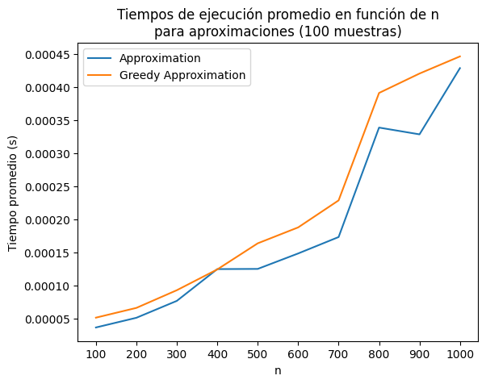
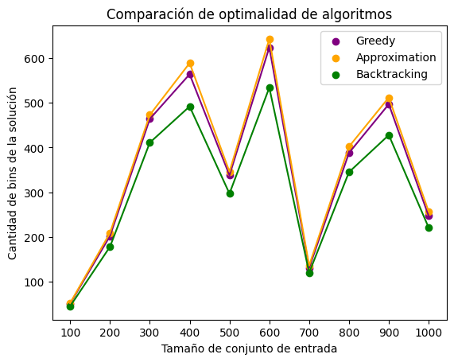

# Trabajo Práctico 2: Problema de Empaquetamiento

El presente trabajo busca evaluar el desarrollo y análisis de un problema NP Completo, la implementación de una solución exacta así como una aproximada y su análisis. La primera fecha de entrega del TP será el 05/06 23, mientras que la segunda fecha de entrega (con reducción de nota) será el 12/06/23.

## Definición del problema
Dado un conjunto de n objetos cuyos tamaños son {T1, T2, · · · , Tn}, con Ti ∈ (0, 1], se debe empaquetarlos usando la mínima cantidad de envases de capacidad 1.

## Enunciado

1. Demostrar que el problema de empaquetamiento es NP-Completo.
2. Programar un algoritmo por Backtracking/Fuerza Bruta que busque la solución exacta del problema. Indicar la complejidad del mismo. Realizar mediciones del tiempo de ejecución, y realizar gráficos en función de n.
3. Considerar el siguiente algoritmo: Se abre el primer envase y se empaqueta el primer objeto, luego por cada uno de los objetos restantes se prueba si cabe en el envase actual que está abierto. Si es así, se lo agrega a dicho envase, y se sigue con el siguiente objeto. Si no entra, se cierra el envase actual, se abre uno nuevo que pasa a ser el envase actual, se empaqueta el objeto y se prosigue con el siguiente.
Este algoritmo sirve como una aproximación para resolver el problema de empaquetamiento. Implementar dicho algoritmo, analizar su complejidad, y analizar cuán buena aproximación es. Para esto, considerar lo siguiente: Sea I una instancia cualquiera del problema de empaquetamiento, y z(I) una solución óptima para dicha instancia, y sea A(I) la solución aproximada, se define A(I) z(I) ≤ r(A) para todas las instancias posibles. Calcular r(A) para el algoritmo dado, demostrando que la cota está bien calculada. Realizar mediciones utilizando el algoritmo exacto y la aproximación, con el objetivo de verificar dicha relación.
4. [Opcional] Implementar alguna otra aproximación (u algoritmo greedy) que les parezca de interés. Comparar sus resultados con los dados por la aproximación del punto 3. Indicar y justificar su complejidad.

Se recomienda realizar varias ejecuciones con distintos conjuntos de datos del mismo tamaño y promediar los tiempos medidos para obtener un punto a graficar. Repetir para valores de n crecientes hasta valores que sean manejables con el hardware donde se realiza la prueba.

#### Ejemplo

Si tenemos el siguiente ejemplo: T = {0.4; 0.8; 0.5; 0.1; 0.7; 0.6; 0.1; 0.4; 0.2; 0.2}, la solución exacta es:

```
E1 = {0.5; 0.4; 0.1}
E2 = {0.8; 0.2}
E3 = {0.7; 0.2; 0.1}
E4 = {0.6; 0.4}
Total de 4 envases
```

La solución dada por la aproximación dada será:

```
E1 = {0.4}
E2 = {0.8}
E3 = {0.5; 0.1}
E4 = {0.7}
E5 = {0.6; 0.1}
E6 = {0.4; 0.2; 0.2}
Total de 6 envases
```
#### Datos de entrada

Los datos deben venir en un archivo de texto con el siguiente formato:

```
n
<linea en blanco>
T1
T2
T3
...
Tn
```

#### Invocación

Se debe invocar al programa como: ```./tdatp2 <E>|<A>|<A2> <datos.txt>```

Donde E indica que se debe calcular la solución exacta, A indica que se debe calcular la solución usando la aproximación propuesta por el curso, A2 indica que se debe calcular la solución usando la aproximación propuesta por el grupo.

#### Salida del programa

La salida por salida estándar deberá ser:

```
<Solución Exacta>|<Solución Aproximada>|<Solución Aproximada Alumnos>: #Envases
<Tiempo de ejecución en mseg>
```

# Resolución

---
1. Demostrar que el problema de empaquetamiento es NP-Completo.
---

## ¿Es un problema NP?

Demostraremos que el problema de empaquetamiento es NP mediante una version de problema de decision.

*Dado un conjunto de n objetos cuyos tamaños son {T1, T2, · · · , Tn}, con Ti ∈ (0, 1], ¿se puede empaquetarlos usando **exactamente k** envases de capacidad 1?*

Sencillamente, para verificar que la solucion es correcta, basta con contar la cantidad de envases. Esto implica una complejidad O(k), complejidad que es evidentemente polinomial.

## ¿Algún problema NP-completo se puede reducir a este, mediante operaciones polinomiales?

*In other words, ¿es NP-Completo?*

Reducir el [problema de particionamiento](https://en.wikipedia.org/wiki/Partition_problem) a este problema es relativamente sencillo. Dado un conjunto  S ={s1, ..., sn; si ∈ ℕ}, input del problema de particionamiento, debemos generar otro input del problema de empaquetamiento de la siguiente forma: se define C = sum(S) / 2 como la capacidad de cada subset solución, para luego generar T = {t1, ..., tn; ti = si / C}.

Nos aseguramos que, como cada elemento de T proviene de haberse dividido un elemento de S por C, la suma de los elementos de T es 2. Esto implica algunas consecuencias:
- Si existiese una particion de T, en T1 y T2, tal que sum(T1) = sum(T2), entonces inevitablemente cada particion deberia sumar 1.
- Si no existiese, cualquier particion posible de T en T1 y T2 implicaria que sum(T1) > 1 y sum(T2) < 1, o viceversa.

Y es aca donde podemos usar *la caja negra que resuelve el problema del empaquetamiento*. Bueno, mejor dicho, utilizaremos la caja negra que resuelve la version de problema de decision (descripto anteriormente), con k = 2 (*...¿se puede empaquetarlos usando **exactamente 2** envases de capacidad 1?*). Una vez aplicado el algoritmo y obtenida la solución, verificamos:
- Si la cantidad de envases devuelta es 2, entonces cada envase suma un tamaño 1. Multiplicamos cada elemento por C para recuperar los valores originales, y retornamos ambos envases/sets como solucion al problema de particion.
- Si la cantidad de envases es mayor a 2, esto quiere decir que no existe solucion para el problema de particion.

---
4. [Opcional] Implementar alguna otra aproximación (u algoritmo greedy) que les parezca de interés. Comparar sus resultados con los dados por la aproximación del punto 3. Indicar y justificar su complejidad.
---

#### Algoritmo

El algoritmo propuesto es una variante de la aproximación del punto 3 con la particularidad de previamente ordenar los elementos de T con el fin de (potencialmente) mejorar la eficiencia de la utilización de los bins, por ejemplo, para aquellas situaciones en las que un objeto grande se empaqueta en un bin que podría haber contenido varios objetos más pequeños, haciendo que se desperdicie la capacidad restante del bin.

Procedimiento:

```
Crear una lista de bins solución vacía
Ordenar T en orden descendente
Por cada ítem en T:
    Si el ítem excede la capacidad del bin actual:
        Añadir el bin actual a la lista de bins solución
        Actualizar el bin actual con únicamente el nuevo ítem actual
    Si no la excede
        Agregarlo al bin actual y actualizar su suma de ítems
Retornar la lista de bins
```

Código Python:

```python
def greedy_approximation_solution(T): # O(n * log(n))
    T.sort(reverse=True) # O(n * log(n))

    bins = []
    current_bin = []
    current_sum = 0

    for item in T: # O(n)
        if current_sum + item > BIN_CAPACITY:
            bins.append(current_bin)
            current_bin = [item]
            current_sum = item
        else:
            current_bin.append(item)
            current_sum += item

    bins.append(current_bin)

    return bins
```

La complejidad del algoritmo es sencilla de calcular debido a la simplicidad del algoritmo propiamente; se ordena de mayor a menor T, ```O(n * log(n))```, y luego se itera por cada uno de los elementos del conjunto T, ```O(n)```, realizando operaciones ```O(1)``` por cada una de sus iteraciones. La parte más costosa del procedimiento es el ordenamiento, por lo tanto, la complejidad final del algoritmo es ```O(n * log(n))```.

#### Análisis de tiempo de ejecución y eficiencia

Para comparar este algoritmo con la aproximación anterior se realizaron ejecuciones con distintos conjuntos de datos de mismo tamaño y se promediaron los tiempos medidos, como se sugirió. Esto se realizó para tamaños de conjunto en un intervalo de 100 a 1000, con un step de 100. Por otro lado, la cantidad de muestras elegida para calcular los promedios fue de 100 debido a que fue el mayor valor (fijo) que el hardware utilizado podía soportar para las simulaciones cuando el tamaño de conjunto se iba acercando a 1000.

Como puede observarse a continuación, donde se grafica el tiempo promedio requerido para la ejecución con un tamaño de conjunto en el intervalo mencionado, nuestra aproximación siempre superó en tiempo a la aproximación de la consigna, aunque siempre tuvieron un comportamiento similar, fácilmente identificable, ya que ambas curvas suelen incrementar sus pendientes en los mismos puntos (a pesar de algunos picos que, creemos, tras múltiples ejecuciones corresponden a ruido generado por retrasos producidos por procesos del sistema en que se realizaron las ejecuciones); los tiempos de ejecución de ambas aproximaciones siempre difirieron en menos de 0.00005 segundos para todos los tamaños de conjunto utilizados en la simulación.



Ya vimos que la propuesta que realizamos, aunque se asemeja bastante a la aproximación, siempre la supera en tiempo. Ahora analicemos su eficiencia.

Para esto, veamos qué sucede con las soluciones que proveen estas aproximaciones comparándolas con la solución óptima que provee backtracking.



Como esperábamos, nuestra propuesta (muy similar a la aproximación del enunciado pero añadiendo el ordenamiento del conjunto), aunque en muchos puntos coincide con la aproximación, se acerca más a la solución óptima. A partir de esta comparación de soluciones pudimos reafirmar que el ordenamiento permite que los elementos más grandes se empaqueten primero, facilitando una mejor utilización de los bins y reduciendo la cantidad necesaria.
