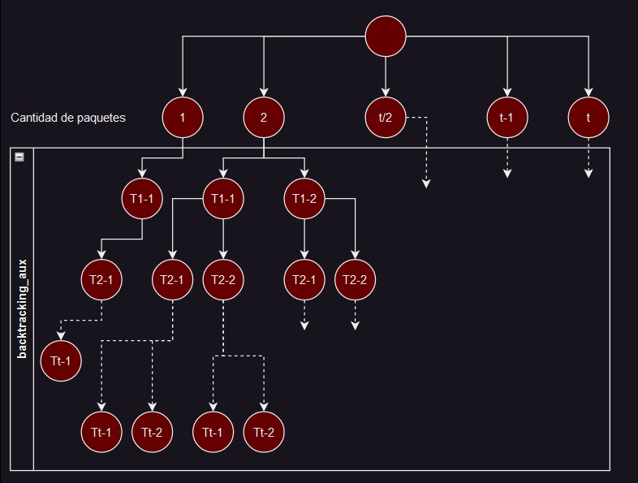
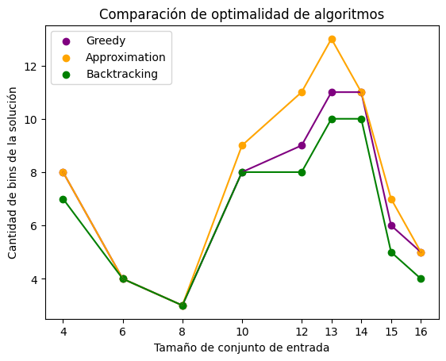

# Trabajo Práctico 2: Problema de Empaquetamiento

El presente trabajo busca evaluar el desarrollo y análisis de un problema NP Completo, la implementación de una solución exacta así como una aproximada y su análisis. La primera fecha de entrega del TP será el 05/06 23, mientras que la segunda fecha de entrega (con reducción de nota) será el 12/06/23.

## Definición del problema
Dado un conjunto de n objetos cuyos tamaños son {T1, T2, · · · , Tn}, con Ti ∈ (0, 1], se debe empaquetarlos usando la mínima cantidad de envases de capacidad 1.

## Enunciado

1. Demostrar que el problema de empaquetamiento es NP-Completo.
2. Programar un algoritmo por Backtracking/Fuerza Bruta que busque la solución exacta del problema. Indicar la complejidad del mismo. Realizar mediciones del tiempo de ejecución, y realizar gráficos en función de n.
3. Considerar el siguiente algoritmo: Se abre el primer envase y se empaqueta el primer objeto, luego por cada uno de los objetos restantes se prueba si cabe en el envase actual que está abierto. Si es así, se lo agrega a dicho envase, y se sigue con el siguiente objeto. Si no entra, se cierra el envase actual, se abre uno nuevo que pasa a ser el envase actual, se empaqueta el objeto y se prosigue con el siguiente.
Este algoritmo sirve como una aproximación para resolver el problema de empaquetamiento. Implementar dicho algoritmo, analizar su complejidad, y analizar cuán buena aproximación es. Para esto, considerar lo siguiente: Sea I una instancia cualquiera del problema de empaquetamiento, y z(I) una solución óptima para dicha instancia, y sea A(I) la solución aproximada, se define A(I) z(I) ≤ r(A) para todas las instancias posibles. Calcular r(A) para el algoritmo dado, demostrando que la cota está bien calculada. Realizar mediciones utilizando el algoritmo exacto y la aproximación, con el objetivo de verificar dicha relación.
4. [Opcional] Implementar alguna otra aproximación (u algoritmo greedy) que les parezca de interés. Comparar sus resultados con los dados por la aproximación del punto 3. Indicar y justificar su complejidad.

Se recomienda realizar varias ejecuciones con distintos conjuntos de datos del mismo tamaño y promediar los tiempos medidos para obtener un punto a graficar. Repetir para valores de n crecientes hasta valores que sean manejables con el hardware donde se realiza la prueba.

#### Ejemplo

Si tenemos el siguiente ejemplo: T = {0.4; 0.8; 0.5; 0.1; 0.7; 0.6; 0.1; 0.4; 0.2; 0.2}, la solución exacta es:

```
E1 = {0.5; 0.4; 0.1}
E2 = {0.8; 0.2}
E3 = {0.7; 0.2; 0.1}
E4 = {0.6; 0.4}
Total de 4 envases
```

La solución dada por la aproximación dada será:

```
E1 = {0.4}
E2 = {0.8}
E3 = {0.5; 0.1}
E4 = {0.7}
E5 = {0.6; 0.1}
E6 = {0.4; 0.2; 0.2}
Total de 6 envases
```
#### Datos de entrada

Los datos deben venir en un archivo de texto con el siguiente formato:

```
n
<linea en blanco>
T1
T2
T3
...
Tn
```

#### Invocación

Se debe invocar al programa como: ```./tdatp2 <E>|<A>|<A2> <datos.txt>```

Donde E indica que se debe calcular la solución exacta, A indica que se debe calcular la solución usando la aproximación propuesta por el curso, A2 indica que se debe calcular la solución usando la aproximación propuesta por el grupo.

#### Salida del programa

La salida por salida estándar deberá ser:

```
<Solución Exacta>|<Solución Aproximada>|<Solución Aproximada Alumnos>: #Envases
<Tiempo de ejecución en mseg>
```

## Resolución

---
1. Demostrar que el problema de empaquetamiento es NP-Completo.
---

### ¿Es un problema NP?

Demostraremos que el problema de empaquetamiento es NP mediante una version de problema de decision.

*Dado un conjunto de n objetos cuyos tamaños son {T1, T2, · · · , Tn}, con Ti ∈ (0, 1], ¿se puede empaquetarlos usando **exactamente k** envases de capacidad 1?*

Sencillamente, para verificar que la solución es correcta, basta con:

- Contar la cantidad de bins, que implica una complejidad O(k).
- Cotejar que la suma de los elementos de cada bin sea 1 o menos. Se recorre cada uno de los k bins y se suman los elementos de los objetos que contiene, lo cual será O(n).
- Confirmar que las particiones obtenidas del empaquetamiento son subsets disjuntos del set original. Esto se puede realizar en O(n), por ejemplo, construyendo dos diccionarios de ocurrencias (uno para el set original y otro para el conjunto de subsets). El primero puede construirse utilizando como clave cada elemento del set y como valor la cantidad de ocurrencias, y el segundo de la misma manera pero iterando por cada uno de los elementos de cada uno de los subsets (bins), y si estos no coincidieran, la solución no sería correcta. Construir cada diccionario es O(n), así realizar la comparación de los mismos, por lo que en total toda esta verificación sería O(n).

En resumen, cada chequeo individual es O(n) por lo que efectivamente la verificación es polinomial.

### ¿Algún problema NP-completo se puede reducir a este, mediante operaciones polinomiales?

*In other words, ¿es NP-Completo?*

Reducir el [problema de particionamiento](https://en.wikipedia.org/wiki/Partition_problem) a este problema es relativamente sencillo. Dado un conjunto  S ={s1, ..., sn; si ∈ ℕ}, input del problema de particionamiento, debemos generar otro input del problema de empaquetamiento de la siguiente forma: se define C = sum(S) / 2 como la capacidad de cada subset solución, para luego generar T = {t1, ..., tn; ti = si / C}.

Nos aseguramos que, como cada elemento de T proviene de haberse dividido un elemento de S por C, la suma de los elementos de T es 2. Esto implica algunas consecuencias:
- Si existiese una particion de T, en T1 y T2, tal que sum(T1) = sum(T2), entonces inevitablemente cada particion deberia sumar 1.
- Si no existiese, cualquier particion posible de T en T1 y T2 implicaria que sum(T1) > 1 y sum(T2) < 1, o viceversa.

Y es aca donde podemos usar *la caja negra que resuelve el problema del empaquetamiento*. Bueno, mejor dicho, utilizaremos la caja negra que resuelve la version de problema de decision (descripto anteriormente), con k = 2 (*...¿se puede empaquetarlos usando **exactamente 2** envases de capacidad 1?*). Una vez aplicado el algoritmo y obtenida la solución, verificamos:
- Si la cantidad de envases devuelta es 2, entonces cada envase suma un tamaño 1. Multiplicamos cada elemento por C para recuperar los valores originales, y retornamos ambos envases/sets como solucion al problema de particion.
- Si la cantidad de envases es mayor a 2, esto quiere decir que no existe solucion para el problema de particion.


---
2. Programar un algoritmo por Backtracking/Fuerza Bruta que busque la solución exacta del problema. Indicar la complejidad del mismo. Realizar mediciones del tiempo de ejecución y realizar gráficos en función de n.
---

#### Algoritmo

```python
EPSILON = 0.00000002

def count(L):
    return sum(list(map(lambda l: len(l), L)))

def is_valid(M):
    if not M: return False
    return all(sum(m) <= 1+EPSILON for m in M)

def backtracking_aux(bins, T, t):
    if count(bins) == len(T): # O(T)
        return bins

    for b in range(0, min(t+1, len(bins))): # O(K)
        bins[b].append(T[t]) # O(1)
        if is_valid(bins): # O(T)
            res = backtracking_aux(bins, T, t+1) # T(T-1)
            if is_valid(res): # O(T)
                return res
        bins[b].pop() # O(1)
    
    return None


def backtracking_solution(T):
    """
    Obtiene la solución exacta al problema del empaquetamiento
    de minimización realizando un llamado a un función que lo
    resuelve por backtraking.
    """

    base = math.ceil(sum(T)-EPSILON)
    global it
    for K in range(base, len(T)+1):
        it = 1
        bins = [[] for _ in range(K)]
        if (res := backtracking_aux(bins, T, 0)):
            return res
    return None
```

Evaluemos el caso particular de la funcion *backtracking_aux*. Esta funcion evalua si se pueden empaquetar los T objetos en K paquetes, y devuelve el empaquetamiento. Si no existe un empaquetamiento con K paquetes, devuelve None. El algoritmo funciona de la siguiente manera: siendo *bins* el conjunto de paquetes solucion (parcial):

- Evaluamos si los *bins* poseen todos los objetos de T: si es asi, devolvemos M como solucion definitiva.

- Por cada paquete *bin* existente:
    - Pruebo meter el objeto t en el *bin*:
    - Si la solucion es valida (el *bin* no se pasa de 1), entonces:
        - Vuelvo a llamar a la funcion *backtracking_aux*, para probar con el objeto t+1.
        - Si lo que devuelve la llamada a la funcion es una solucion, entonces devolvemos esa solucion como la definitiva.
    - Si no, removemos el objeto t del bin.


- Si luego de probar meter el objeto t en todos los bins las soluciones no son validas, entonces esta solucion parcial no es valida. Retornamos None.

Podemos observar que, cada llamada a *backtracking_aux* detonara, en el peor de los casos, una nueva llamada a si misma por cada paquete *bin* (llamemos **b** a la cantidad total de bins) que evaluemos. Esto nos permite deducir que su ecuacion de recurrencia es, aproximadamente: **T(t) = b * T(t-1)**. Finalmente, deducimos que la complejidad algoritmica de *backtracking_aux* es, a priori, **O($b^t$)**.

Dado que no sabemos a priori cual es el optimo de paquetes, deberemos probar con desde un paquete en adelante, hasta hallar una cantidad de paquetes que nos permita distribuir los objetos. Esto implica que la funcion *backtracking_aux* es llamada (ejecutandose en un tiempo de O($b^t$)) indeterminadas veces.

De esta manera, nuestro "arbol" de posibilidades a evaluar se ve de la siguiente manera:



#### Reduciendo el rango de paquetes

Partamos declarando algunas afirmaciones:
- Un set de objetos de tamaño **t** siempre podra ser empaquetado en **t** o mas paquetes.
    - Tecnicamente hablando, un set de tamaño **t** puede ser empaquetado en **t** paquetes de manera optima si y solo si todos sus elementos valen 1. Cuando la cantidad de paquetes es mayor a **t**, siempre habra al menos un paquete vacio.
- Un set de objetos cuya suma de elementos sume **s**, no podra ser empaquetado en menos de **S**=ceil(**s**) (**s** redondeado al entero mas cercano por arriba) paquetes.

Esto quiere decir que el numero optimo de paquetes se encontrata entre la suma de los valores de los objetos, y la cantidad de objetos. Por ende, nos permite definir que no probaremos todas las cantidad de paquetes posibles, sino solo dentro del rango mencionado. Esto nos permite observar que la complejidad algoritmica total seria de **O( (t+1-S) * b^t )** (+1, debido a que siempre llamaremos al algoritmo al menos una vez para obtener el optimo); observemos que aun se mantiene la naturaleza exponencial del algoritmo.

Aqui cabe preguntarse: ¿qué tan pequeño puede ser **S**? ¿Tendremos que llamar **t** veces a *backtracking_aux* en el peor de los casos?

La respuesta a la segunda pregunta es que no: en el peor de los casos, se llamara a *backtracking_aux* **t/2** veces (con una varianza de un llamado extra bajo ciertas condiciones). Procedamos a demostrar esto:

>Imaginemos a un set de tamaño T donde cada elemento en T vale 0.5+Ɛ, siendo Ɛ un numero tan pequeño que tiende a 0 pero que no llega a serlo. Podriamos definir a este set como el set con la cantidad de elementos mas pequeños que no pueden compartir paquetes entre ellos.
>
>sum(setT) = T*(0.5+Ɛ) ≈ **T/2 + Ɛ**, lo cual redondeado hacia abajo es **T/2**.
>
>Sin embargo, dado que cada elemento es mayor a 0.5, no pueden existir mas de dos elementos dentro de un mismo paquete. Esto quiere decir que el numero de paquetes optimos para este set es, precisamente, T. Entonces, nuestro algoritmo probara encontrar un empaquetamiento con un numero de paquetes desde T/2 hasta T. Ahora, evaluemos todos los casos donde modifcamos ligeramente el set T:
>
>- **Si incrementamos la cantidad de elementos del set agregando otro 0.5+Ɛ** (o un elemento de mayor valor), entonces, dependiendo si T es par o impar, la suma redondeada hacia arriba de sus elementos se incrementara en 1. Independientemente de esto, si incrementamos la cantidad de elementos en dos 0.5+Ɛ, inevitablemente la suma redondeada se incrementara en 1, por lo que las llamadas a *backtracking_aux* aun seran T/2, probando con paquetes desde T/2 a T.
    - **Si en cambio decrementamos la cantidad de elementos del set**, pasara lo contrario.
>- **Si agregamos un objeto de valor menor a 0.5**, el set tendra tamaño T'=T+1, y la suma redondeada hacia arriba de sus elementos, en el peor de los caso, seguira siendo la misma: T/2. Pero esto tambien quiere decir que este ultimo objeto agregado podra compartir paquete con cualquier otro de los elementos de valor 0.5+Ɛ, por lo que su cantidad de paquetes optima seguira siendo T (no T'), provocando que *backtracking_aux* aun se siga llamando T/2 veces.
>- **Si en cambio reducimos un objeto a un valor menor a 0.5**, entonces la suma redondeada hacia arriba de sus elementos seguira siendo T/2, pero dado que esta reduccion permite al objeto reducido compartir paquete con otro, por lo que el numero de paquetes optimo se reducira a T-1, lo cual implica que se realizaran T/2 - 1 llamados a *backtracking_aux*.
>- Por supuesto, **incrementar el valor de alguno de los objetos** no cambia el tamaño del set, ni la suma redondeada hacia arriba de sus elementos.

Como podemos observar, en ninguno de los casos provocamos un incremento en la cantidad de llamados que deberan hacerse a *backtracking_aux*. Finalmente, podemos concluir que, hasta ahora, la complejidad temporal de nuestro algoritmo es de **O($\sum_{b={t \over 2}}^{t} b^t$ )**. Esto, por supuesto, sigue siendo de naturaleza exponencial.

>Cabe aclarar que no necesariamente la sumatoria comienza desde t/2 y llega hasta t, estrictamente. Lo que buscamos reflejar en la sumatoria es que, en el peor de los casos, nuestro algoritmo debera probar empaquetar el set con t/2 numeros distintos de paquetes. Por supuesto, eso quiere decir que la suma de los valores de un set podria dar menos que t/2, y aun asi, como mucho, nuestro algoritmo iterara, a partir de ese valor, sobre un maximo de t/2 numeros consecutivos. Esto tambien nos permite aclarar que en el peor de los casos, ademas de iterar sobre t/2 numeros, esos numeros se podrian encontrar entre t/2 y t, lo cual llevaria, efectivamente, al **peor** peor caso de todos.

Todo este analisis nos permite realizar una gran poda, deshaciendonos del analisis de la mitad del arbol:


#### Aplicación de otra optimización

Pensemos en un caso de ejemplo: un set de tamaño T=4, y evaluaremos si es posible empaquetarlos en B=3 paquetes.


*Aclaración: Cada nodo Tt-b indica la accion donde el objeto t se guarda en el paquete b.*

Comenzaremos evaluando el objeto T1: ¿Entra en el paquete B1? Si, debido que, por ahora, todos los paquetes se encuentran vacios. Esta es nuestra unica posible accion.

Tomamos el objeto T2: Aqui tenemos dos posibles acciones:
- Si cabe, guardarlo en B1, que ya posee T1.
- Si no cabe en B1, entonces lo guardamos en alguno de los paquetes vacios restantes (B2 o B3).

Asumamos que guardamos T2 en B2, porque no entra en B1.

Tomamos el objeto T3: Aqui, se nos suma una posible accion mas:
- Si cabe, guardarlo en B1, que ya posee T1.
- Si no cabe en B1, guardarlo en B2, si cabe, que ya posee T2-
- Si no cabe en B1 ni B2, guardarlo en B3.

Asumamos que guardamos T3 en B3, porque no entra en B1 ni B2.

Tomamos el objeto T4. A partir de aqui, las posibles acciones posibles son las mismas que antes: si entra en Bi, guardarlo en Bi; si no, probar con el siguiente.

**Supongamos que T4 no entra en ninguno de los 3 paquetes (lo cual nos permitiria intuir desde ahora que no existe solución para este set con 3 paquetes)**. Esto quiere decir que no existe solucion guardando T3 en B3. Pero dado que guardar T3 en B3 era nuestra unica accion posible, entonces esto quiere decir no existe solucion al guardar T2 en B2. Entonces, guardamos T2 en B3, y evaluamos nuevamente posibles acciones podemos hacer con T3. 

Hagamos una pausa: acabamos de observar que guardar T2 en el paquete vacio B2 no nos permitio encontrar una solución. ¿Por que mover T2 al otro paquete vacio B3 haria alguna diferencia respecto a esto? Tanto B2 como B3 son etiquetas que hemos puesto para dos paquetes que, al momento de ubicar T2, se encuentran vacios. Es casi natural intuir que mover T2 de un paquete vacio al otro tampoco generara una solucion posible.

Entonces haber ubicado T1 en B1 no nos brindara ninguna solucion: movemos T1 a otro paquete vacio. Pero, nuevamente, y analogamente a la situacion anterior, mover un objeto de un paquete vacio a otro, no provocara algun cambio a la hora de evaluar los siguientes objetos nuevamente. Entonces, finalmente, podemos concluir que no existe un empaquetamiento para 4 objetos en 3 paquetes.

**En general, mover un objeto T de un paquete vacio a otro paquete vacio, no nos permite explorar posibilidades nuevas donde pueda haber una solución.**

En otras palabras, para los primeros paquetes Pi donde i < B, solo debemos evaluar si Pi entra en alguno de los primeros Bi paquetes posiblemente ocupados con maximo un objeto, o guardarlo en un paquete vacio, dejando solo i acciones posibles para los primeros Pi, y B posibilidades para los Pi donde i >= B.

Esto quiere decir que, si antes cada llamada a *backtracking_aux* implicaba b nuevas llamadas recursivas, ahora con esta optimizacion presente, la cantidad de llamadas recursivas se reduce en relacion al valor de B:
- Sin optimizacion: b * b * b * ... * b = **b^t** llamados recursivos.
- Con optimizacion: 1 * 2 * 3 * ... * b-1 * b * b * ... * b = **b! * b^(t-b)** llamados recursivos.

Quizas el factorial de b pueda dar indicios de que nuestra complejidad sera peor, pero basta con plantear la inecuacion para llegar a que *b^b > b!*. Esto permite ejecutar la función *backtracking_aux* en **O($b! * b^{t-b}$)**

Graficamente, la poda se veria de la siguiente manera.


#### Conclusión

Finalmente, luego de todas las podas analizadas, podemos concluir con rigurosidad que nuestra complejidad algoritmica de todo el algoritmo es **$$O( \sum_{b={t \over 2}}^{t} b! * b ^ {t-b} )$$**

#### Análisis de los resultados

Con el algoritmo implementado se realizaron mediciones del tiempo de ejecución requerido para múltiples tamaños de T, llegándose a la conclusión de que utilizando un set random, nuestro hardware podía resolver en un tiempo considerable conjuntos de hasta 16 elementos, esto debido al crecimiento exponencial de las iteraciones en relación al tamaño de T. Dedujimos también que si T no estaba compuesto por elementos aleatorios y, por ejemplo, poseía solo elementos de valor 0.1, uno podía aumentar el tamaño del input tanto como quisiera.

Como a fines de este análisis no nos interesaba el caso feliz, nos dipusimos a construir muestras con el tamaño de T en el rango [4, 16] y con un step de 2. A partir de obtener 100 muestras para cada uno de esos 7 tamaños, calculamos el promedio de tiempo que llevo cada una y graficamos y obtuvimos el siguiente gráfico:


Habiendo una tendencia constante que comienza a aumentar en n=12, decidimos agregar unas mediciones más; n=13 y n=15, con el fin de obtener una visión más detallada del crecimiento exponencial del tiempo de ejecución cuando n aumentaba en el rango [12, 16]:


Es evidente la naturaleza exponencial del algoritmo. Observamos que a partir de una muestra de tamaño 12, el algoritmo comienza a crecer abruptamente en relacion a su tiempo de ejecucion; algo propio y esperado de los algoritmos de complejidad exponencial, categoria en el cual entra nuestro algoritmo.

---
3. Considerar el siguiente algoritmo: Se abre el primer envase y se empaqueta el primer objeto, luego por cada uno de los objetos restantes se prueba si cabe en el envase actual que está abierto. Si es así, se lo agrega a dicho envase, y se sigue con el siguiente objeto. Si no entra, se cierra el envase actual, se abre uno nuevo que pasa a ser el envase actual, se empaqueta el objeto y se prosigue con el siguiente.
Este algoritmo sirve como una aproximación para resolver el problema de empaquetamiento. Implementar dicho algoritmo, analizar su complejidad, y analizar cuán buena aproximación es. Para esto, considerar lo siguiente: Sea I una instancia cualquiera del problema de empaquetamiento, y z(I) una solución óptima para dicha instancia, y sea A(I) la solución aproximada, se define A(I) z(I) ≤ r(A) para todas las instancias posibles. Calcular r(A) para el algoritmo dado, demostrando que la cota está bien calculada. Realizar mediciones utilizando el algoritmo exacto y la aproximación, con el objetivo de verificar dicha relación.
---

#### Algoritmo

A continuación, se muestra la implementación en Python de la aproximación de la consigna que tiene un procedimiento Greedy debido a su estrategia de tomar la mejor decisión local en función de la información disponible en el momento en cada paso, sin preocuparse por las consecuencias a largo plazo. Se coloca el objeto en el primer envase disponible que puede contenerlo y no se considera la posibilidad de reorganizar los objetos ya colocados en los bins para encontrar una mejor solución global.


```python
def approximation_solution(T): # O(n)
    """
    Se va insertando los elementos de T en bins linealmente, si algún
    elemento no entra en el bin actual, se crea uno nuevo.
    """
    bins = []
    current_bin = []
    current_sum = 0

    for item in T: # O(n)
        if current_sum + item > BIN_CAPACITY:
            bins.append(current_bin)
            current_bin = [item]
            current_sum = item
        else:
            current_bin.append(item)
            current_sum += item

    bins.append(current_bin)

    return bins
```

Fácilmente se observa que el algoritmo cumple con las características Greedy de ser muy simple y eficiente en términos de tiempo de ejecución ya que solo requiere un recorrido lineal de los elementos de T y, por lo tanto, **la complejidad es ```O(n)```**.

A pesar de esto, debido a su enfoque local sus soluciones no siempre coincidirán con la solución óptima, pero lo que sí podemos hacer es analizar la cota superior en la relación entre la solución de este algoritmo y la solución óptima.

#### Cota superior del algoritmo

Definiendo ```A(I) z(I) ≤ r(A)``` para todas las instancias posibles, donde:

```
I: instancia cualquiera del problema de empaquetamiento
z(I): solución óptima para dicha instancia
A(I): solución aproximada
```

En primer lugar, para cualquier solución pero, en particular para z(I), la suma de los elementos de I es una cota inferior:

```
z(I) >= sum(I)
```

Importante: se deberia redondear hacia el entero mayor o igual más inmediato.

##### Demostración para cantidad de bins par

Ahora consideremos el siguiente planteo: es imposible para 2 bins contiguos estar llenos cuanto mucho hasta la mitad, porque eso implicaría que en algún momento habiendo un bin lleno cuanto mucho hasta la mitad (pudiéndose aún insertar elementos) se abrió otro para colocar un elemento de cuanto mucho 0.5 (que podría haber cabido en el bin anterior).

Sea ```B = {B1, ..., BA}``` el conjunto de los A bins solución, donde A es par y Bi representa cada uno de los bins, entonces:

```
sum(B1) + sum(B2) > 1, … , sum(BA-1) + sum(BA) > 1
```

Si combinamos esas desigualdades, obtenemos la siguiente cota para la sumatoria de los elementos de los bins, dado que tomé A elementos de a pares y cada par era estrictamente mayor a 1:

```
sum(B1) + sum(B2) + … + sum(BA-1) + sum(BA) > A(I)/2  ->  sum(Bi) > A(I)/2, i ∈ [1, A]
```

Debido a que la sumatoria total de los elementos en cada bin es igual a la sumatoria de los elementos de la instancia original I:

```
∑ sum(Bi) = sum(I)  ->  sum(I) > A(I)/2
```

Ahora tenemos dos inecuaciones, combinémoslas:

```
z(I) >= sum(I) (1)
sum(I) > A(I)/2 (2)

-> z(I) >= sum(I) > A(I)/2
```

Por transitividad, z(I) está acotado también. Despejemos...

```
z(I) > A(I)/2 
-> 2 z(I) > A(I)
-> 2 z(I) > A(I)
-> 2 > A(I)/z(I)
-> A(I)/z(I) < 2
-> R(A) = 2
```

##### Demostración para cantidad de bins impar

Se demuestra de forma análoga;

Sea ```B = {B1, ..., BA-1}``` el conjunto de los A-1 bins solución, donde A-1 es impar y Bi representa cada uno de los bins, entonces, todas las sumas de elementos de bins contiguos tendrán un valor mayor a 1, a excepción de la suma del último elemento (individual por ser una cantidad impar) que podrá tomar cualquier valor. No detallaremos cada paso dado que de aquí en más son análogos a la demostración del caso par.

```
sum(B1) + sum(B2) > 1, … , sum(BA-1) > 0 -> sum(BA) + sum(B2) + … + sum(BA-1) > (A(I)-1)/2  ->  sum(Bi) > (A(I)-1)/2

-> ∑ sum(Bi) = sum(I)  ->  sum(I) > (A(I)-1)/2

z(I) >= sum(I) (1)
sum(I) > (A(I)-1)/2 (2)

-> z(I) >= sum(I) > (A(I)-1)/2
-> z(I) > (A(I)-1)/2 
-> 2 z(I) > (A(I)-1)
-> 2 > (A(I)-1)/z(I)
-> (A(I)-1)/z(I) < 2
-> (A(I)-1) < 2 z(I)
-> A(I) < 2 z(I) + 1
-> A(I) <= 2 z(I)
-> R(A) = 2
```

Por lo tanto, la cota superior encontrada indica que para cualquier instancia del algoritmo de aproximación, su solución tendrá cuanto mucho el doble de bins que la solución óptima.


#### Análisis empírico de la relación

Para verificar el cumplimiento de la relación obtenida realizamos gráficos colocando en el eje X el número de instancia I (arbitrario) y en el eje Y el resultado de la expresión A(I)/Z(I) utilizando múltiples muestras de tamaño de set fijo. A continuación, observemos dos gráficos para tamaño de set 8 y 10 respectivamente, utilizando 100 muestras.


Como puede observarse para estos gráficos con 100 muestras, la cota siempre se cumplió e incluso fue bastante menor. Repetimos este procedimiento con múltiples tamaños de set y siempre obtuvimos resultados similares. Es por esto que decidimos reiterar el procedimiento pero utilizando muestras aún mayores.


En estos gráficos, ahora con muestras de 100000 elementos (aunque utilizando los mismos tamaños de set que en el experimento anterior) pudimos identificar instancias del problema del empaquetamiento en que la relación (o *approximation ratio* alcanzó el valor 1.8, bastante más cercano a la cota, pero jamás excediéndola.

---
4. [Opcional] Implementar alguna otra aproximación (u algoritmo greedy) que les parezca de interés. Comparar sus resultados con los dados por la aproximación del punto 3. Indicar y justificar su complejidad.
---

#### Algoritmo

El algoritmo propuesto es una variante de la aproximación del punto 3 con la particularidad de previamente ordenar los elementos de T con el fin de (potencialmente) mejorar la eficiencia de la utilización de los bins, por ejemplo, para aquellas situaciones en las que un objeto grande se empaqueta en un bin que podría haber contenido varios objetos más pequeños, haciendo que se desperdicie la capacidad restante del bin.

#### Procedimiento

```
Crear una lista de bins solución vacía
Ordenar T en orden descendente
Por cada ítem en T:
    Si el ítem excede la capacidad del bin actual:
        Añadir el bin actual a la lista de bins solución
        Actualizar el bin actual con únicamente el nuevo ítem actual
    Si no la excede
        Agregarlo al bin actual y actualizar su suma de ítems
Retornar la lista de bins
```

#### Código Python

```python
def greedy_approximation_solution(T): # O(n * log(n))
    T.sort(reverse=True) # O(n * log(n))

    bins = []
    current_bin = []
    current_sum = 0

    for item in T: # O(n)
        if current_sum + item > BIN_CAPACITY:
            bins.append(current_bin)
            current_bin = [item]
            current_sum = item
        else:
            current_bin.append(item)
            current_sum += item

    bins.append(current_bin)

    return bins
```

La complejidad del algoritmo es sencilla de calcular debido a la simplicidad del algoritmo propiamente; se ordena de mayor a menor T, ```O(n * log(n))```, y luego se itera por cada uno de los elementos del conjunto T, ```O(n)```, realizando operaciones ```O(1)``` por cada una de sus iteraciones. La parte más costosa del procedimiento es el ordenamiento, por lo tanto, la complejidad final del algoritmo es ```O(n * log(n))```.

#### Análisis de tiempo de ejecución y eficiencia

Para comparar este algoritmo con la aproximación anterior se realizaron ejecuciones con distintos conjuntos de datos de mismo tamaño y se promediaron los tiempos medidos, como se sugirió. Esto se realizó para tamaños de conjunto en un intervalo de 100 a 1000, con un step de 100. Por otro lado, la cantidad de muestras elegida para calcular los promedios fue de 100 debido a que fue el mayor valor (fijo) que el hardware utilizado podía soportar para las simulaciones cuando el tamaño de conjunto se iba acercando a 1000.

Como puede observarse a continuación, donde se grafica el tiempo promedio requerido para la ejecución con un tamaño de conjunto en el intervalo mencionado, nuestra aproximación siempre superó en tiempo a la aproximación de la consigna, aunque siempre tuvieron un comportamiento similar, fácilmente identificable, ya que ambas curvas suelen incrementar sus pendientes en los mismos puntos (a pesar de algunos picos que, creemos, tras múltiples ejecuciones corresponden a ruido generado por retrasos producidos por procesos del sistema en que se realizaron las ejecuciones); los tiempos de ejecución de ambas aproximaciones siempre difirieron en menos de 2.5e-6 segundos (diferencia máxima en el pico que se produce por el orden de los elementos de la instancia) para todos los tamaños de conjunto utilizados en la simulación.


Ya vimos que la propuesta que realizamos, aunque se asemeja bastante a la aproximación, siempre la supera en tiempo. Ahora analicemos su eficiencia.

Para esto, veamos qué sucede con diferentes soluciones que proveyeron estas aproximaciones comparándolas con la solución óptima que proveyó backtracking. Esta vez, utilizamos muestras con tamaño de set más pequeño debido a que las limitaciones de tiempo y hardware que implican las ejecuciones del algoritmo de backtracking.





Como esperábamos, en todos los gráficos para distintas instancias del problema elegidas, se verifica que nuestra propuesta (muy similar a la aproximación del enunciado también Greedy pero añadiendo el ordenamiento del conjunto), aunque en muchos puntos coincide con la aproximación, se acerca más a la solución óptima. A partir de esta comparación de soluciones pudimos reafirmar que el ordenamiento permite que los elementos más grandes se empaqueten primero, facilitando una mejor utilización de los bins y reduciendo la cantidad necesaria.

Además, como chequeo adicional, nuevamente verificamos la cota hallada y descripta en el punto 3, para ninguna ejecución la solución del algoritmo de aproximación fue mayor al doble del óptimo.
