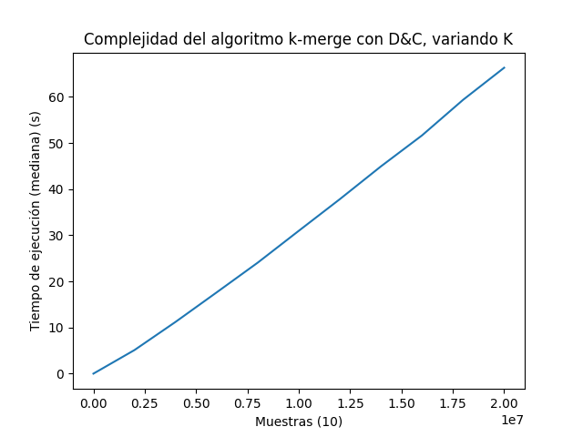

# Trabajo Práctico 1: Técnicas de Diseño

## Primera Parte: Problema de K-merge por División y Conquista

### Introducción

El problema de K-merge es el siguiente: se tienen K arreglos ordenados, y se quiere quiere obtener un único arreglo, también
ordenado, con todos los elementos de los arreglos originales (inclusive si hay repetidos). Por simplicidad para los diferentes
análisis se puede suponer que todos los arreglos tienen exactamente h elementos (por ende, la cantidad total de elementos es
n = K ∗ h).
Para resolver este problema, es posible que hayan visto en Algoritmos y Programación II un algoritmo que resuelve este
problema utilizando un Heap. Nos referiremos a este como el algoritmo que utiliza Heaps.
La idea en este caso será plantear otra solución y analizarla. Se propone el siguiente algoritmo por división y conquista, con
semejanzas a mergesort.
1. Caso base: cuando quede un único arreglo, simplemente devolver dicho arreglo.
2. En el caso general, dividir la cantidad de arreglos entre la primera mitad, y la segunda mitad, y luego invocar
recursivamente para cada mitad de arreglos. Es decir, si tenemos cuatro arreglos, invocamos para los primeros 2, y
luego para los segundos 2. Al terminar los llamados recursivos, tenemos dos arreglos ordenados. Estos deberán ser
intercalados ordenadamente, tal cual se realiza en mergesort.

### Consigna

1. Determinar, utilizando el Teorema Maestro, cuál sería la complejidad del algoritmo propuesto.

    El Teorema Maestro nos provee una forma sencilla de estimar la complejidad temporal de un algoritmo. Para su aplicacion debemos determinar los siguientes aspectos de nuestroa algoritmo:
    - La cantidad de llamados recursivos que realiza el algoritmo.
    - La proporcion del problema original que se pasa al llamado recursivo.
    - La costo algoritmico de partir en subproblemas y juntar las subsoluciones. 
    
    El algoritmo propuesto describe que la lista de K arreglos original debe ser dividida en dos mitades, para posteriormente realizar llamados recursivos sobre ella. Esto nos permite inducir que se realizan dos llamados recursivos, donde la proporcion del problema evaluada en el llamado es de la mitad del problema.
    
    Por otra parte, partir el problema puede implementarse a traves de la actualizacion de indices que indiquen el inicio y final del subproblema, sin necesidad de realizar un slice sobre el problema original; esto puede realizarse en tiempo constante.
    
    Por último, el problema indica que la junta de los subproblemas debe realizar mediante un algoritmo de intercalamiento, como el utilizado en mergesort. Esta junta (en mergesort) es O(n), y en este caso seria de manera similar. Sabiendo que n = K * h, el costo de juntar las subsoluciones también será de O(n).
    
    Con esto en mente, nuestra ecuación de recurrencia quedaría de la siguiente manera: T(n) = 2 * T(K/2) + O(n), y, por el Teorema Maestro, podemos afirmar que la complejidad del algoritmo propuesto es de O(n * log2(K)).


---

### Cómo ejecutar los scripts

#### Simulación

```$ python3 simulator.py```

La configuración de la simulación se encuentra en el archivo *simconfig.json*. Los archivos con los resultados se guardan en la carpeta *results*.

Los nombres de los resultados corresponden a la hora en la que finalizó su simulación.

#### Plotting

```python3 complexity-check.py [results\example.json]```

Los gráficos se guardan en la carpeta *plots*, en una carpeta con el mismo nombre del example.json. Hay un archivo *plot* y uno *diff*. Este *README* lee imágenes de la carpeta *plot*.

2. Describir el algoritmo que utiliza heaps, y determinar su complejidad.

    A continuación, se enuncia el algoritmo y en simultáneo se va detallando la complejidad de cada operación. El K-merge con heaps trabaja tomando al comienzo el primer elemento de cada uno de los K arreglos ordenados e insertándolos (encolándolos) en un heap de mínimos (en O(K), justamente por ser un heap), que servirá posteriormente para ir siempre sabiendo cuál es el elemento de valor más chico y así ir construyendo el arreglo final.

    ¿Cómo logramos esto? Para empezar, no se guarda simplemente el valor del arreglo, sino que también se guarda el número del arreglo al que pertenece y el índice dentro de ese arreglo (en este caso, se puede realizar con un struct o una sencilla clase con tan solo los 3 atributos mencionados). La importancia de esto es que se utilizará para en un loop ir desencolando del heap el elemento más pequeño, agregándolo al arreglo final y encolando el siguiente elemento (si lo hubiera) del arreglo al que pertenecía el elemento que se desencoló. Esto sucederá hasta que el heap no tenga más elementos, que a su vez solo sucederá una vez que cada uno de los h elementos de cada uno de los K arreglos hayan pasado por el heap (es decir, se hayan encolado, agregado al arreglo final y luego desencolado).

    Debido a que las operaciones de encolar y desencolar dentro del loop se realizan en O(log(K)) (estrictamente sería O(log(K)) + O(log(K)) porque son dos operaciones por cada iteración) y esto se realizará por la cantidad total de elementos, como indica la consigna, n = K * h), las operaciones del loop se realizan en O(n * log(K)).

    Como O(n * log(K)) es mayor que O(K) ya que n = K * h, entonces la complejidad del algoritmo es O(n * log(K)).
    
---

3. Implementar ambos algoritmos, y hacer mediciones (y gráficos) que permitan entender si las complejidades obtenidas para cada uno se condicen con la realidad.

    Hemos observado que tanto el algoritmo propuesto con merge como el algoritmo de heaps tienen una complejidad temporal de O(n * log(K)), siendo n = K * h.
    
    ## K-merge con D&C
    
    Dado que el problema de k-merge presenta dos variables en su contexto (K: cantidad de arreglos ordenados, h: tamaño de esos arreglos), mostrar su desempeño mediante gráficos nos obligaria a que estos gráficos sean tridimensionales. Sin embargo, la **regla del producto** nos permite asegurarnos que **O(K * h * log(K)) = O(h) * O(K * log(K))**. De poder identificar que partes de cada algoritmo son las que añaden cada una de las complejidades (O(h) y O(K * log(K)), solo necesitaríamos un gráfico por cada complejidad temporal, para poder probar la complejidad temporal total de cada algoritmo. ¡Y podemos identificarlas! 
    
    **O(K * log(K))** es la complejidad temporal de ordenar K arreglos ordenados de un solo elemento, lo que tambión podria significar ordenar un arreglo de K elementos con merge. Esto explica por qué esta parte tiene la misma complejidad que el algoritmo Mergesort.
    
    **O(h)**, por otra parte, es la complejidad temporal de mergear dos arreglos ordenados, dado que inevitablemente se deberan recorrer ambos arreglos de inicio a fin para realizar el intercalado. El costo temporal de este merge crece linealmente respecto de h.
    
    *"Pero alumnos, este es un solo algoritmo. No podemos correr la parte de O(h) por un lado y la parte de O(K * log(K))" por otro lado"*. Es cierto que no podemos particionar el algoritmo y evaluarlos por separados. Lo que **sí** podemos hacer, es setear una variable con una constante, y evaluar el desempeño del algoritmo cuando la otra variable *varía*. Así, si el tamaño de todos los arreglos fuese de uno (h = 1), sería lo mismo que tener números individuales, lo que desembocaría en un Mergesort (O(K * log(K))). Si en cambio siempre tuviésemos 2 arreglos de h elementos (K = 2), entonces el algoritmo solo se encargaría de separarlos del arreglo de arreglos (lo cual es O(1)), y luego debería mergearlos (lo cual, como ya vimos, es O(h)). *¿Por qué K es 2, y no 1?*, si hubiese solo un arreglo ordenado, entonces el algoritmo solo debería devolver el arreglo, sin hacer merge, pudiendo hacerlo en O(1).
    
        
    ### Análisis de la parte *mergesort* del algoritmo

    Como se mencionó previamente, si h = 1, entonces el algoritmo debería comportarse de manera semejante a Mergesort. Al realizar mediciones y graficar los costos temporales de correr el algoritmo con determinada muestra (lineal), esperaremos encontrarnos con un gráfico semejante a un n * log2(n).

    El siguiente gráfico muestra los resultados de evaluar el algoritmo en una secuencia de 1 a 20.000.000, en intervalos de 2.000.000, donde cada muestra ha sido evaluada 10 veces, y calculado la mediana de los resultados de cada muestra.

    
    
    Si bien podría pertenecer a un intervalo de alguna función del estilo f(n) = n * log2(n), también podría ser un intervalo de una función lineal g(n) = n. Esto quiere decir que para generar una muestra mucho mas exacta, debemos realizar simulaciones mucho mas refinadas, implicando esto una secuencia de cantidades mucho mas grandes, mayor repetición de pruebas para cada cantidad, y, en consecuencia, mucho mas tiempo de ejecución (simular para obtener estas mediciones ha llevado cerca de una hora).

    Sin embargo, podemos aprovechar las propiedades matemáticas de las funciones, y calcular una "derivada" de la muestra. Si la muestra siguiese una proporción lineal, entonces la diferencia entre los tiempos debería ser (casi) constante, dado que la derivada de una funcion linear es una función constante. Pero si la muestra siguiese efectivamente una proporción de n * log2(n), entonces la diferencia entre tiempos deberia seguir una proporción logarítmica, dado que la derivada de n * log2(n) es log2(n) + 1/ln(2) (y podemos ignorar la constante 1/ln(2)).

    

    Podemos observar que, con algunos altibajos, las diferencias entre tiempos siguen una proporción logarítmica, lo cual nos permite confirmar que esta parte del algoritmo es O(K * log(K))

    ### Análisis de la parte de *merge* del algoritmo

    Cuando K = 2, podemos medir cómo funciona la parte del ordenamiento por merge del algoritmo. Como se menciono previamente, se estima que esta parte tiene una complejidad temporal de O(h).

    El siguiente gráfico muestra los resultados de evaluar el algoritmo en una secuencia de 1 a 10.000.001, en intervalos de 1.000.000, donde cada muestra ha sido evaluada 10 veces, y calculado la mediana de los resultados de cada muestra.

    

    Podemos observar que las mediciones siguen una proporción lineal, pero para descartar la posibilidad de un posible n * log(n), graficaremos también las diferencias entre tiempos.
    
    

    A diferencia de los diffs obtenidos al medir la parte de O(K * log(K)), que mostraban una proporción logarítmica, en estos diffs se puede observar un comportamiento que a simple vista parece errático, pero que al notar que el intervalo donde oscila la muestra es de solo 0,0175 segundos, y no pareciera haber signos de una monotonía creciente o decreciente (sino un comportamiento oscilante), podemos afirmar que esta parte del algoritmo es O(h).
    
    ## K-merge con Heaps

    En esta sección volveremos a hacer uso de las propiedades que nos permitieron analizar el K-merge con D&C a partir de evaluar por separado los componentes de la complejidad del algoritmo. Recordemos, como se explicó detalladamente en el punto 2), la complejidad del K-merge con heaps es de O(h * k * log(K)). Para ello, primero deduzcamos qué sucede al fijar el valor de cada variable para este caso.
    
    Si la cantidad de elementos por arreglo (h) fuera uno (1), la complejidad del algoritmo sería O(K * log(K)), es decir, ya podríamos graficar en dos dimensiones. También podríamos animarnos a hacer un paralelismo (no tan literal como en el caso del K-merge con D&C, pero posible) con Heapsort, siendo éste un algoritmo que también utiliza un heap, del cual va desencolando para ir ordenando el arreglo inicial, lo que lo hace tener una complejidad de O(n * log(n)) donde n es la longitud del arreglo inicial. Sin embargo, esta comparación puede ser innecesaria, debido a que el input de Heapsort es un único arreglo, que es ordenado a partir de desencolar el heap e ir realizando swaps, mientras que K-merge con Heaps se encarga de a partir de múltiples arreglos mergearlos y devolver uno único, y si se tratara del caso en que h es igual a 1, entonces obtendríamos una complejidad de O(K * log(K)), lo cual es muy tentador para vincular ambos algoritmos incluso aunque tengan objetivos diferentes.
    
    ### Análisis del algoritmo con heaps variando k
    
    Una vez más, considerando el caso de h = 1, realizaremos ejecuciones con las mismas características o parámetros que se utilizaron previamente para el análisis de la parte *merge* del K-merge con D&C (secuencia de 1 a 10.000.000, intervalos de 1.000.000, 10 evaluaciones, uso de mediana, etc.) y esperaremos obtener resultados similares a un K * log2(K).
    
    
    
    Al igual que antes, el gráfico no nos permite afirmar que los resultados obtenidos se correspondan de alguna manera con una proporción lineal o logarítmica, incluso notamos algunas curvas más pronunciadas a pesar de que haya una tendencia a la linealidad. Por lo que decidimos analizar múltiples ejecuciones y todas presentaban estas leves curvas. Nuevamente, acudamos al gráfico de pendientes para comprender qué está sucediendo realmente.
    
    
      
    Como sucedió previamente, aunque con mayor variación entre las ejecuciones, encontramos un comportamiento errático pero, sin embargo, en un rango pequeño, donde las variaciones siempre sucedieron con un máximo de 6 segundos, por lo que, debido a que realizamos múltiples ejecuciones y la mayoría presentaban este comportamiento errático pero de algún modo con mayor tendencia positiva (aunque no lo es estrictamente), deducimos una complejidad logarítmica. Creemos que este compartamiento no es propio del algoritmo en sí, sino que se relaciona a características de la computadora en que se realizaron las ejecuciones, ya que procesos en segundo plano del SO pueden fácilmente afectarlas (incluso comprobamos que simplemente mover el mouse al momento de realizar las simulaciones las afectaba de forma significativa), esto sucedió en todas las ejecuciones ejecuciones que realizamos, como en los gráficos que se encuentran en ```plots/2023-04-26_14-32-45```.
      
    ### Análisis del algoritmo con heaps variando h
    
    Como lo hicimos anteriormente, se buscará medir, con K = 2, de forma similar estimamos que la complejidad temporal deberá ser O(h) debido a que por el heap sí o sí pasan todos los elementos de cada uno de los arreglos, y si fijáramos la cantidad de K la única variable que aportaría a la complejidad es la longitud de cada arreglo (h). Otra vez, graficamos con los resultados de evaluar bajo los mismos parámetros que se eligieron para el K-merge con D&C fijando la variable K (secuencia de 1 a 10.000.001, intervalos de 1.000.000, 10 evaluaciones por muestra, uso de mediana con las muestras).
    
    
    
    Ya notamos una tendencia lineal, pero para asegurarnos, vayamos al gráfico de diffs una vez más.
    
    
    
    Como puede observarse, hasta la ejecución 7 notamos una (bastante) sutil variación en el eje Y, con diferencias de menos de 0.3 segundos. Otra vez identificamos esto como oscilaciones que en realidad tienen una tendencia a un valor constante, por lo que podríamos decir (si omitiéramos lo que sucede desde la ejecución 5, que podría ser considerado como ruido relacionado a los motivos que mencionamos en el análisis de la variación de k o otros factores como alguna limitación de hardware, por ejemplo) que se trata de una proporción lineal respecto de la longitud de los arreglos, por lo que la complejidad es efectivamente O(h).

---

4. En caso que la complejidad obtenida en el punto 1 no se condiga con la realidad, indicar por qué (qué condición falla). En dicho caso, se requiere llegar a la complejidad correcta (no solamente enunciarla, sino demostrar cuál es).

    Hemos cometido un error en el punto 1. En nuestro analisis previo, hemos asentado que la ecuacion de recurrencia era la siguiente: **T(n) = 2 * T(K/2) + O(n)**. Sin embargo, el error se encuentra en que el Teorema Maestro no esta preparado para aplicarse a dos variables.

    La variable presentada en el problema es n = K * H, la cantidad total de elementos. Dado que el llamado recursivo sobre n nos permite partir el problema tranquilamente en dos, la ecuacion de recurrencia nos quedaria como **T(n) = 2 * T(n/2) + O(n)**, permitiendonos afirmar que la complejidad del algoritmo es de O(n * log2(n)).

    Sin embargo hemos observado en los graficos que esto no ocurre asi. Variar solo el tamaño de los arreglos (h) nos muestra que estadisticamente el crecimiento en los tiempos es lineal en vez de n * log(n). ¿Esto quiere decir que el Teorema Maestro esta mal? No precisamente. Una de las condiciones para aplicar T.M. es que **el caso base del algoritmo sea constante**, y aqui es donde falla nuestro algoritmo. El caso base del algoritmo, que es retornar un arreglo solo, esta ligado a la variable h, dado que h es la longitud de todos los arreglos del problema.

    Entonces, ¿Cual es su complejidad algoritmica? Si bien el costo de partir y juntar sigue siendo O(n), la cantidad de llamados recursivos no depende de n (total de elementos de todos los arreglos), sino de K, la cantidad de arreglos que tenemos). Nuestro algoritmo realizara dos llamados recursivos sobre la mitad de los arreglos, hasta toparse con el caso base de un solo arreglo, y luego comenzar a mergearlos. Dado que esto ocurre en log2(K) niveles de recursividad donde se realizan estas operaciones con los K arreglos de h elementos, podemos volver a concluir que la complejidad del algoritmo es O(h * K * log(K)) o, lo que es lo mismo, O(n * log(K)), lo cual coincide plenamente con lo observado en los graficos.

---

5. Indicar cualquier conclusión adicional que les parezca relevante en base a lo analizado.

    ### La "derivada" de una muestra

    > La derivada de una función es la **razón de cambio** instantánea con la que varía el valor de dicha función matemática, según se modifique el valor de su variable independiente.

    Al realizar simulaciones sobre diversas muestras, con el objetivo de probar que los tiempos de ejecucion siguen proporcionalmente los estimados por el Big O, nos topamos con diversos resultados que provocaron ciertas confusiones a la hora de analizar los datos obtenidos. Una de estas confusiones fue provocada por los graficos obtenidos al plotear los resultados de las simulaciones.

    Planteemos un ejemplo: es claro que la función **f(x) = x** es diferente que **g(x) = x * log2(x)**. Mientras que f(x) es lineal, y su grafico es una linea, g(x) es se encuentra multiplicada por un logaritmo, lo cual implica que su grafico no es propiamente lineal.

    

    Si bien a primera vista es notable que ambas funciones son diferentes (y es que lo son), cuando x es mayor a 1, y a medida que x crece, esta diferencia se desdibuja a la vista. Esto quiere decir que si observaramos cada una de estas funciones en un intervalo acotado, no seria tarea sencilla determinar si dicho intervalo pertenece a una funcion lineal o no.

    Volviendo a nuestro problema: dado que nuestros resultados de las simulaciones son productos de la estadistica, estos pueden mostrar ligeras oscilaciones (respecto de la proporcion que parece seguir), debido a cuestiones referidas al procesamiento de la simulacion (cualquier proceso que la computadora comience a correr de manera aleatoria puede alterar los resultados de la simulacion). Esto puede causar mas confusiones a la hora de graficar la muestra, debido a que sera aun mas dificil determinar si la "curva" mostrada en el grafico sigue alguna proporcion n * log(n).

    A modo de resumen: un grafico con forma de linea no nos permite asegurar si la muestra sigue una proporcion lineal o n * log(n). Pero, pese a esto, podemos realizar algunas afirmaciones dada la matematica detras de este fenomeno.

    Para empezar, la razon de cambio de una funcion lineal ha de ser siempre constante. Si tuviesemos la siguiente muestra, producto de evaluar una secuencia de numeros equidistantes en f(x):

    ```
    [1, 2, 3, 4, 5, 6]
    ```
    Podemos calcular las diferencias entre los elementos consecutivos de la muestra (es decir, lista[i] - lista[i-1]):

    ```
    [1, 1, 1, 1, 1]
    ```
    Y de esta manera, verificar que estas diferencias siguen un patron constante. Si realizaramos lo mismo con una muestra sobre g(x):

    ```
    [0, 2, 4.75488, 8, 11.60964, 15.50977]
    ```
    ```
    [2, 2.75488, 3.24512, 3.60964, 3.90013]
    ```

    A primera vista no pareciera que estas diferencias siguieran algun patron, asi que grafiquemos estos puntos:

    

    Podemos observar que, entonces, las diferencias entre muestras coinciden **muy aproximadamente** con la curva de la derivada de g(x), pero esto es suficiente para demostrar que estas diferencias siguen una proporcion logaritmica binaria.

    ¿Por que realizamos este analisis? Porque es mucho mas facil, a primera vista, diferenciar una funcion logaritmica de una constante, que diferenciar una funcion lineal de una n * log(n). Aprovecharemos esto entonces para reforzar los analisis que hagamos sobre los resultados de las simulaciones.

    ### Comportamiento errático

    Como mencionamos en la sección del análisis del algoritmo que funciona con heaps, tras múltiples simulaciones nos encontramos con algunos obstáculos que complejizaron la deducción y comprobación final de complejidad del algoritmo. Creemos, tras habernos topado con múltiples picos en gráficos de tiempos de ejecución que sucedían exactamente en el momento en que movíamos al mouse así como en los momento en que se oscurecía levemente la pantalla, que el problema no fue la implementación del algoritmo, sino la computadora o su sistema operativo.
    
    En particular, las ejecuciones que presentaron comportamientos erráticos se realizaron en una computadora con MacOS que, como encontramos en la documentación del sitio oficial de desarrolladores ([Apple Developer](https://developer.apple.com/ "Apple Developer")), realiza un manejo de la administración de energía y el rendimiento del procesador que permite reducir el consumo de energía a partir de disminuir la velocidad del procesador para reducir el consumo de energía, lo cual afecta directamente a los tiempos de ejecución del algoritmo, tornando erráticos sus tiempos de ejecución.
    
    Por otro lado, también pueden incidir tareas en segundo plano ya que consumen recursos del sistema, tales como actualizaciones de software, tareas de mantenimiento, procesos de sincronización, procesos de seguridad, procesos de red, entre otros. En este caso, pudimos descartar que los procesos de red afectaran, debido a que realizamos ejecuciones sin conexión wifi y aun así obtuvimos resultados similares, además siempre realizamos las ejecuciones con unicamente la ventana de la terminal abierta (y ningun otro programa abierto en simultaneo) pero, a pesar de eso, siempre encontramos multiples procesos consumiendo recursos en el *Activity Monitor* correspondientes al SO, por lo que, aunque realizamos algunos seteos de configuracion para poder realizar las simulaciones sin que la computadora entre en modo de ahorro de energía o no se suspendiera, no pudimos apalear la situacion.

    Por último, otro factor importante encontrado en el sitio se relaciona con el punto anterior, es la frecuencia con la que el sistema operativo realiza cambios de contexto en el procesador para permitir que otras aplicaciones y procesos se ejecuten en el sistema. Si hay muchos cambios de contexto, el rendimiento del algoritmo puede verse afectado.

    En conclusión, comprendimos que nuestros resultados podrían haber sido mejores si nos hubiéramos asegurado que el sistema esté configurado correctamente para que se minimizaran las interrupciones y retrasos durante la ejecución del algoritmo y así obtener resultados más precisos.
