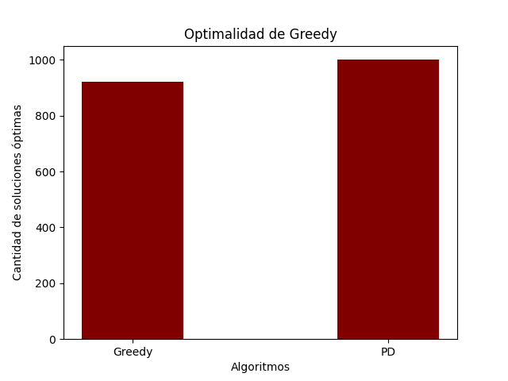

# Trabajo Práctico 1: Técnicas de Diseño

## Segunda Parte: ¡Problema de contrabando!

### Historia y Estado de la situación
Genovia y Krakozhia son países limítrofes muy disímiles. Entre sus muchas diferencias, se encuentran los productos que se pueden producir o ingresar a uno y otro país. En particular, Krakozhia pertenece a la Unión Europea, haciendo que sea muy restrictiva con algunas clases de productos

Por el contrario, el Reino de Genovia casi no tiene restricciones ni en el acceso ni en la producción de productos. Este es uno de los problemas que tienen con sus vecinos de la Unión Europea (el otro, es ser considerando un paraíso fiscal).

Es muy común que ciudadanos de Krakozhia viajen a Genovia, y aprovechen su estadía para comprar productos que no podrían comprar en su país. Incluso hay quienes aprovechan para comprar bastantes productos, para luego revenderlos en Krakozhia, a un alto precio. ¿El problema? es ilegal entrar con esos productos a la Unión Europea, y en particular a Krakozhia, por lo que sus agentes aduaneros deberían confiscarles los productos (y potencialmente labrarles un acta o algún otro tipo de sansión). ¿Lo bueno? Los agentes aduaneros de Krakozhia no destacan por su honestidad. El menos corrupto no puede armar una declaración jurada de ingresos medianamente creíble. Esto quiere decir que al pasar por la aduana, un agente aduanero puede pedir, en concepto de soborno, una cierta cantidad de algunos productos que se lleve consigo (luego de revisarlos), el cual debe pagarse sí o sí, si no se quiere caer en serios problemas.

### Planteo del problema

Queremos pasar mercadería de contrabando de Genovia a Krakozhia. La mercadería viene en paquetes que no podemos abrir. Cada paquete i trae Xi unidades de un determinado tipo de producto j. Podríamos llegar a tener varios paquetes del mismo tipo de producto j, incluso con diferente cantidad de unidades. También podemos tener diferentes paquetes de diferentes productos. Es decir, cada paquete (in-abrible) es de una cantidad específica de un tipo específico, y en total para un tipo específico j tenemos la suma de Xi unidades, para todos los i que sean de ese tipo.

Para nuestro ejemplo, supongamos que tenemos un paquete que trae 8 cajetillas de cigarrillos sabor arándano. Otro paquete trae 5 cajetillas de lo mismos cigarrillos. Otro paquete puede traer 5 botellitas de 100ml de vodka radioactivo, etc...

Al pasar por la aduana, el corrupto funcionario puede indicarnos que “por acá no pasan sin dejarme al menos 6 cajetillas de cigarrillos de arándano”.

Ante la imposibilidad de abrir y/o separar los paquetes, es claro que en dicho caso nos conviene dejar el paquete de 8 (no podemos abrirlo para sacar 6 de allí... sino la movida sería muy evidente). Si el oficial hubiera dicho que hay que dejar al menos 10 cajetillas, habría sido necesario dejar ambos paquetes para un total de 13 unidades de dicho producto. Si este hubiera dicho que le dejemos una cajetilla de cigarrillos y una botellita de vodka, tendríamos que dejar el paquete de 5 botellitas de vodka y el paquete de 5 cajetillas de cigarrillos.

### Consigna

---

1. Describir e implementar un algoritmo greedy que, dado un input con los productos que se tienen, y lo pedido como soborno, nos permita salir airosos de la situación, con la mayor cantidad de productos posibles. Justificar por qué el algoritmo es, efectivamente, greedy. Considerar que siempre se nos pedirá una cantidad de productos en existencias (en nuestro ejemplo anterior, no nos habrían pedido que dejemos 7 botellas de vodka radioactivo, ni tampoco mandarinas del Sahara).

---

#### Planteo: el problema del contrabando y su relación con el problema de la mochila

El problema del contrabando plantea una situación donde un contrabandista debe pasar una cantidad de paquetes de mercaderia a traves de una Aduana, donde se nos demandara un soborno de una cantidad arbitraria de algunos (o todos) los productos que pasemos.

Habiendo presentado un poco de contexto, replanteemos el problema desde otro angulo: 
1) Un contrabandista lleva una mochila para cada **producto i** que posee, de **capacidad Xi**, donde cada una de las mochilas se encuentra llena en su capacidad.
2) Al pasar por la Aduana, el funcionario nos dira que, para cada producto i que llevamos, solo podremos llevarnos a Krakovia, como maximo, una cantidad **Xi - Si**, donde Si es el soborno que debemos pagarle al funcionario (si para cierto producto j no hay demanda de soborno, entonces Sj = 0). Esto es lo mismo que decir que la capacidad de nuestras mochilas i se reduce a Xi - Si.
3) Para cada producto i, teniendo una cantidad de paquetes que en total suman Xi productos, y una mochila i de capacidad Xi - Si, nuestro objetivo sera maximizar el valor que podemos almacenar en la mochila. En este caso, dado que cada paquete contiene una cantidad arbitraria **del mismo producto**, podemos asumir que su valor es exactamente igual a su peso o cantidad de espacio que ocupa en la mochila.

Esto nos permite concluir que estamos ante una versión del problema de la mochila. De esto, podemos deducir algunas conclusiones:
- Debemos calcular el problema de la mochila para cada producto que este incluido en la demanda de sobornos. Esto nos permite anticipar el problema de la mochila tendra una complejidad de **O(P * O(algoritmo_mochila))** (a no ser que alguna operacion imprevista en el algoritmo para el problema del contrabando supere esta complejidad).
- Dado que la capacidad de la mochila sera Xi - Si, primero debemos calcular Xi, que sera la suma de todos los pesos de los paquetes traidos de Genovia. Esta operacion es **O(n)**.
- A diferencia del problema de K-merge planteado en el ejercicio anterior, aqui, la cantidad de paquetes (independientemente de la cantidad de contenido que tengan), no sera la misma para cada uno de los productos. Debemos tener esto en cuenta a la hora de realizar simulaciones.

    #### Implementación

    ##### Formato del input

    La mercadería compuesta por distintos tipos de productos con, a su vez, múltiples paquetes de distintas cantidades se modelará con un diccionario de la siguiente forma:

    ```python
    {'Cigarrillos': [1, 1, 2, 4, 8], 'Vodka': [1, 3, 5, 15]}
    ```

    Por otro lado, los sobornos solicitados, que el algoritmo deberá utilizar para encontrar una solución que cumpla con entregar cierta cantidad de productos minimizando la cantidad de productos a entregar será de la siguiente forma:

    ```python
    {'Vodka': 6, 'Cigarrillos': 6}
    ```

    #### Algoritmo

    Para cada uno de los productos que piden soborno:
    1. Calcular la suma de todos los productos en todos los paquetes, y restarles la cantidad a dar de soborno (llamemos W a este valor).
    2. Ordenar la lista de paquetes en orden decreciente, segun su cantidad de productos.
    3. Inicializar una mochila vacia (lista vacia con capacidad W).
    4. Para cada paquete en la lista de paquetes:
        1. Si el tamaño del paquete es menor o igual a la capacidad de la mochila:
            1. Meter el paquete en la mochila y actualizar su capacidad.
        2. Si la capacidad de la mochila es 0 (ya esta llena), entonces retornar la mochila.
    
    5. Finalmente, retornar la mochila.

    Este algoritmo es, efectivamente, Greedy. Aplicamos una regla sencilla como es la regla de "si entra, que entre", que nos permita obtener el mejor resultado al evaluar determinado paquete, para que luego, en caso de que el paquete entre en la mochila, se repita la misma evaluacion pero con una capacidad actualizada. Es una regla muy intuitiva, y es probablemente lo que una persona haría de toparse con este problema en una situacion cotidiana.


---

2. Con las mismas consideraciones que en el punto anterior, describir e implementar un algoritmo (que sea óptimo) que resuelva el problema utilizando programación dinámica.
---


#### Implementacion del algoritmo

Como hemos mencionado anteriormente, este problema es una version del problema de la mochila:


```python
def pasar_aduana(paquetes: dict, soborno: dict):
    for producto, cantidad in soborno.items(): # O(P)
        paquetes[producto] = mochila_dp(paquetes[producto], sum(paquetes[producto]) - cantidad) # Suma: O(E)
    
    return paquetes

def mochila_dp(elementos: list, W: int):
    """
    Creacion de la matriz de memorizacion
    """
    E = len(elementos) # O(1)
    OPT = [[0 for _ in range(W+1)] for _ in range(E+1)] # O(W * E)
    
    for e in range(1, E+1): # O(E)
        for w in range(1, W+1): # O(W)

            if w < elementos[e-1]: # O(1)
                OPT[e][w] = OPT[e-1][w] # O(1)
            else:
                OPT[e][w] = max(
                    OPT[e-1][w], # O(1)
                    elementos[e-1] + OPT[e-1][w - elementos[e-1]] # O(1)
                    ) # O(1)

    
    """
    Generación del resultado en base a M
    """
    mochila = [] # O(1)
    e = E # O(1)
    w = W # O(1)

    while w > 0 and e > 0: # O(E)
        if OPT[e][w] > OPT[e-1][w]: # O(1)
            mochila.append(elementos[e-1]) # O(1)
            w -= elementos[e-1] # O(1)
        e -= 1 # O(1)

    return mochila
```

#### Descripción del algoritmo

- Para cada petición de soborno (tipo de producto y cantidad):
    - Siendo **W** la nueva capacidad de la mochila (total de productos menos cantidad solicitada de soborno) y **E** la cantidad de paquetes que posee el contrabandista.
    - Crear la matriz OPT de memorizacion (E * W) y llenar la primera fila (fila 0) y primera columna (columna 0) con ceros. Cada posicion **(e, w)** representa la solucion optima para una mochila de capacidad **w**, teniendo en cuenta los primeros **e** paquetes de la lista.
    - Para cada fila **e** de OPT, de 1 a E:
        - Para cada columna **w** de OPT, de 1 a W:
            - Si el paquete **e** tiene un peso mayor a la capacidad **w**, entonces la solucion optima sera la de la posicion **(e-1, w)** (la solucion optima para una mochila de capacidad w, teniendo en cuenta los paquetes anteriores al **e**).
            - Si no, la solucion optima sera el maximo entre:
                - La solucion optima de **(e-1, w)**.
                - La suma entre el peso del paquete **e** (e[peso]) y la solucion optima **(e-1, w-e[peso])** (optimo de mochila con la capacidad que tendria si el nuevo paquete ocupase un lugar en ella, teniendo en cuenta los paquetes anteriores al **e**).
    - *Comentario: una vez terminadas las iteraciones sobre la matriz OPT, la cantidad maxima de productos que nos podemos llevar con los paquetes se encontrara en la posicion (e, w).*
    - Para obtener la mochila optima con los paquetes que podemos llevarnos, seteamos un puntero en la posicion **(e, w)** de M.
    - Mientras **e** y **w** sean mayor a 0:
        - Si la solucion optima de la mochila con capacidad **w** para los primeros **e** paquetes es mayor que la solucion optima para la misma mochila pero sin tener en cuenta el paquete **e** (si OPT(e, w) > OPT(e-1, w)):
            - Agregamos el paquete **e** a la mochila.
            - Evaluamos el optimo de la mochila con capacidad w', sabiendo que el paquete **e** ya esta en la mochila (w = w - e[peso])
        - Evaluamos el caso donde ya no tenemos en cuenta el paquete **e**, sin importar si entro o no en la mochila (e = e - 1).
    - Retornamos la mochila optima.

---

3. Indicar y justificar la complejidad de ambos algoritmos propuestos. Indicar casos (características y ejemplos) de deficiencias en el algoritmo greedy propuesto, para los cuales este no obtenga una solución óptima. 

---

#### Algoritmo Greedy

Dado que debemos iterar sobre todos los sobornos posibles, y como maximo podemos tener una peticion de soborno por todos los productos, tenemos un proceso que se repetirar como mucho P veces (siendo P la cantidad total de tipos de productos que tenemos), dandonos una complejidad O(P).

Para cada uno de estos sobornos, debemos sumar todos los productos de la lista de paquetes, para luego restarle el soborno en si. Esto nos da una complejidad de O(E).

Luego, ordenar la lista de manera decreciente nos brinda una complejidad de O(E * log(E)).

Luego, iterar sobre los productos y aplicar la regla nos da una complejidad de O(E), dado que en el peor de los casos habra que iterar sobre todos los productos.

Ingorando la idea de que tenemos que repetir esto por todos los sobornos, tenemos hasta aqui una complejidad de O(E) + O(E * log(E)) + O(E), lo cual es lo mismo que decir O(E * log(E)). Ahora, sabiendo que tenemos que repetirlo por todos los sobornos, nuestra complejidad final del algoritmo sera de **O(P * E * log(E))**.

Este algoritmo presenta algunos problemas, dado que no siempre devolvera el resultado optimo.

Por ejemplo:

```
paquetes: [20, 20, 18, 17, 11, 11, 11, 8, 3, 3]
soborno: 62 productos
```

Dado que contamos con 122 productos en total, luego del soborno solo podremos quedarnos con 60 productos como mucho. El algoritmo guardara los paquetes 20, 20 y 18, quedando un espacio para dos productos mas. Pero no hay ningun paquete que contenga menos de 3 productos, por lo que ese sera el resultado de algoritmo. Basta observar el arreglo de paquetes para darnos cuenta que agarrando los paquetes 11, 11, 18 y 20 podemos quedarnos con 60 productos y ceder los 62 impuestos por la aduana.

En general, cuando en algun punto del algoritmo nos encontremos con que (teniendo el arreglo ordenado de mayor a menor), habiendo guardado los paquetes [x1, x2, ..., xk], ninguno de los paquetes [xk+1, xk+2, ... xn] pueden entrar en la mochila, aun existe la posibilidad de que entre los paquetes [xk+1, xk+2, ... xn] haya una combinacion de paquetes sea mas optima que la obtenida en [x1, x2, ..., xk].


#### Algoritmo por Programación Dinámica

Dado que debemos iterar sobre todos los sobornos posibles, y como maximo podemos tener una peticion de soborno por todos los productos, tenemos un proceso que se repetirar como mucho P veces (siendo P la cantidad total de tipos de productos que tenemos), dandonos una complejidad O(P).

Por otra parte, para obtener la capacidad W de la nueva mochila debemos sumar todos sus elementos, lo cual nos cuesta O(E), y restarle el soborno S. W, como mucho, valdrá sum(E), si S es 0.

Tanto para crear la matriz OPT como para llenarla, la cantidad de operaciones dependen de la longitud del vector E y de la capacidad de la mochila W. Estas operaciones tienen una complejidad de O(E * W).

Para generar la mochila con los paquetes que nos podemos llevar, dado que debemos verificar paquete por paquete si es posible guardarlo en la mochila, tendremos un costo de O(E).

Teniendo todo esto en cuenta, podemos deducir que la complejidad de este algoritmo es de O(P * E * W); recordando que W como maximo es sum(E). Sin embargo, dado que W es un numero, y no representa una longitud, sino un valor, debemos expresar W en relacion a la longitud de su representacion. Asumiendo que la representacion se realiza en bits, establecemos W = 2^m, siendo m la longitud de W en bits. Finalmente, la complejidad algoritmica nos queda **O(P * E * 2^m)**, lo cual es ni mas ni menos que P multiplicado por la complejidad algoritmica del problema de la mochila en Programacion Dinamica. Y, al igual que el algoritmo del problema de la mochila, nuestro algoritmo tambien es pseudo polinomial. Esto provocara que estadisticamente observemos un comportamiento polinomico aunque, como ya hemos demostrado, su complejidad es exponencial.

---

4. Implementar un programa que utilice ambos algoritmos, realizar mediciones y presentar resultados comparativos de ambas soluciones, en lo que refiere a su optimalidad de la solución (no de su complejidad). Incluir en la entrega del tp los sets de datos utilizados para estas simulaciones (que deben estar explicados en el informe). Estos deben incluir al menos una prueba de volumen, indicando cómo es que fueron generadas.

---

#### Análisis de tiempos de ejecución

En primer lugar, comenzamos realizando simulaciones para obtener los tiempos de ejecución de cada algoritmo si variábamos las variables E y W, siendo E el máximo número de paquetes por cada producto y W un valor que representa el máximo número de productos que podremos quedarnos.

Para esto, limitamos el número de productos por paquete a un máximo de 1000 unidades y generamos paquetes utilizando las siguientes configuraciones en el archivo ```simconfig.json```:

```json
{
    "start": 1,
    "stop": 10001,
    "step": 100,
    "var": "E",
    "do_greedy_knapsack": true,
    "do_dp_knapsack": true
}
```

```json
{
    "start": 1,
    "stop": 10001,
    "step": 100,
    "var": "W",
    "do_greedy_knapsack": true,
    "do_dp_knapsack": true
}
```

Con estas configuraciones se construyeron gráficos que superponían ambos algoritmos mostrando la variación de cada variable en el eje X y el tiempo de ejecución en segundos que requirió para cada cantidad del eje X. Veamos a continuación dos ejemplos.

#### Análisis variando E


A primera vista, el algoritmo Greedy parecía constante y el algoritmo de PD a pesar de fluctuar tenía una notoria tendencia lineal, de todos modos, con una pendiente muy baja, difiriendo como máximo en 0.25 segundos de más respecto de la última ejecución que realiza la simulación, cuando E llega a 10000. Veamos más en detalle qué sucede con el algoritmo Greedy.


Como se ve analizando el comienzo y el final de la "curva" en realidad hay también fluctuaciones pero a pesar de eso una tendencia creciente por parte del algoritmo Greedy, aunque con una variación máxima de menos de 0.002 segundos al E alcanzar el valor 10000.

#### Análisis variando W


El gráfico obtenido de la ejecución con la variación de W arrojó resultados similares a la variación de E para el algoritmo de PD, con un claro crecimiento lineal esta vez alcanzando un tiempo de ejecución mayor (0.5 segundos), específicamente el doble del valor que habíamos obtenido al alcanzar 10000 unidades de E) esto puede deberse a que, al aumentar el tamaño de W en las iteraciones del loop interno de *mochila_dp* y así incrementar la cantidad máxima posible que uno puede quedarse, habrán muchos más casos donde no se descarten paquetes, lo cual es más costo por la cantidad de operaciones que se realizan al pasar por esa rama de la lógica del algoritmo. Por otro lado, a simple vista resultados similares para el algoritmo Greedy. Analicemos nuevamente más en profundidad el caso Greedy.


Como esperábamos, en realidad la variación de H no afectó al algoritmo Greedy, que a diferencia de lo que sucedió con la variación de E, esta vez no registró una tendencia creciente y se mantuvo constante en 0 hasta alcanzar el valor máximo de W.

#### Análisis variando E y W aleatoriamente

Una vez analizado qué sucedía con cada variable, decidimos variarlas en simultáneo y aleatoriamente para poder comparar nuestro algoritmo Greedy con nuestro algoritmo de PD y así evaluar el rendimiento del algoritmo en un rango bien amplio de escenarios posibles, ya sabiendo que el algoritmo Greedy no siempre iba a alcanzar el óptimo, pero cuando lo hiciera sería más velozmente. Este planteo nos permite observar el comportamiento del algoritmo asegurándonos probar una gran variedad de combinaciones de valores para W y E y tener una mejor visión de su funcionamiento en diferentes situaciones.

Para ello elegimos utilizar un barplot, donde se mostrara la cantidad de veces que se alcanzó el resultado óptimo para cada uno de los algoritmos (a pesar de que el algoritmo de PD siempre va a ser óptimo). Para este caso, nuevamente limitamos el número de productos por paquete a un máximo de 1000 unidades, y esta vez elegimos variar ambas variables entre 1 y 5001 como se ve en la siguiente sección.

Configuración de ```simconfig.json``` elegida:

```json
{
    "start": 1,
    "stop": 5001,
    "step": 1,
    "var": "random",
    "do_greedy_knapsack": true,
    "do_dp_knapsack": true
}
```




